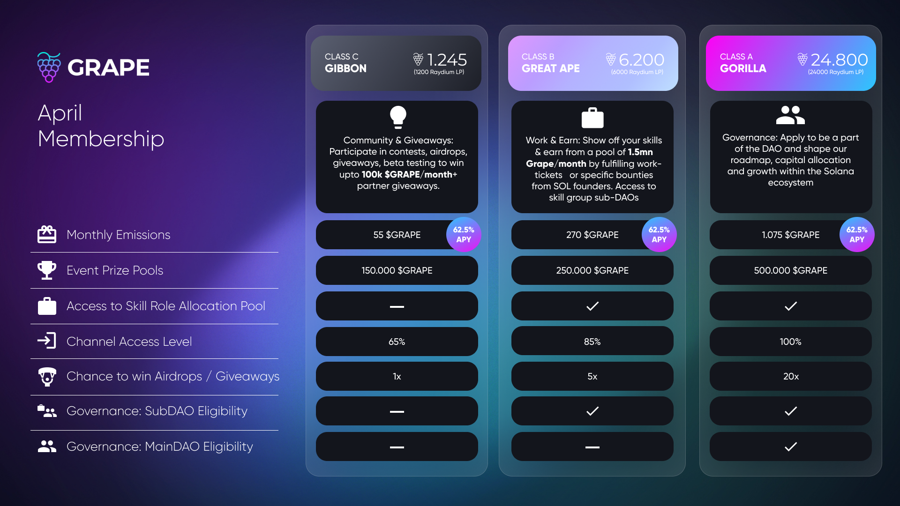

# Get involved - and benefit!

Being part of a community is easy these days. Shaping the future of an entire ecosystem? Not so much. But with Grape, you actually can! How you might ask? Well, everyone has certain skills, a special talent, or is pretty good at something. We at Grape believe that everyone can contribute, your job is to find out how. The easiest way to start and engage with the community is on Discord. [<mark style="color:purple;">**Join us!**</mark>](https://discord.gg/greatape)<mark style="color:purple;">****</mark>

If you already joined us on Discord, great! Then have a look at what we’ve got in store for you, be it becoming a member or even getting a [<mark style="color:purple;">**Skill Role**</mark>](skill-roles.md) and actively participating in a [<mark style="color:purple;">**subDAO**</mark>](../../grape-subdaos/sub-daos.md).

### Membership Benefits

Grape Membership: A way to get entertained, learn, and network **Crypto-Style**!

* Access to exclusive high-level research around Solana NFTs, Defi strategies, and AMAs.
* Ability to join the GRAPE workforce, request work, and earn more $GRAPE.
* Participation in giveaways, airdrops, beta tests.
* Contests and events with $GRAPE prizes.
* Guaranteed monthly emissions based on your Class.

Based on the current emission schedule, the inflation expected in 2022 from Community Emissions is the following:

* 5.3% **January** 74.8M circulating tokens
* 4.9% **February** 80.3M circulating tokens
* 4.66% **March** 85.8M circulating tokens
* 4.38% **April** 91.3M circulating tokens
* 4.13% **May** 96.8M circulating tokens
* 3.91% **June** 102.3M circulating tokens
* 3.7% **July** 107.8M circulating tokens
* 3.5% **August** 113.3M circulating tokens
* 3% **September** 130M circulating tokens Team + Investors first unlock
* 2.7% **October** 143M circulating tokens
* 2.5% **November** 156.1M circulating tokens
* 2.36% **December** 169.2M circulating tokens

**Current Membership**

To compensate token holders for the emission schedule and prevent the dilution of their voting power, token requirements are connected to the expected emissions in the next epoch.&#x20;

**As seen in the infographic above the token requirements per class increased by** \~4.38%, **for the month of April 2022, to:** &#x20;

Class C - Gibbon 1,245 $GRAPE

Class B - Great Ape 6,200 $GRAPE

Class A - Gorilla 24,800 $GRAPE

