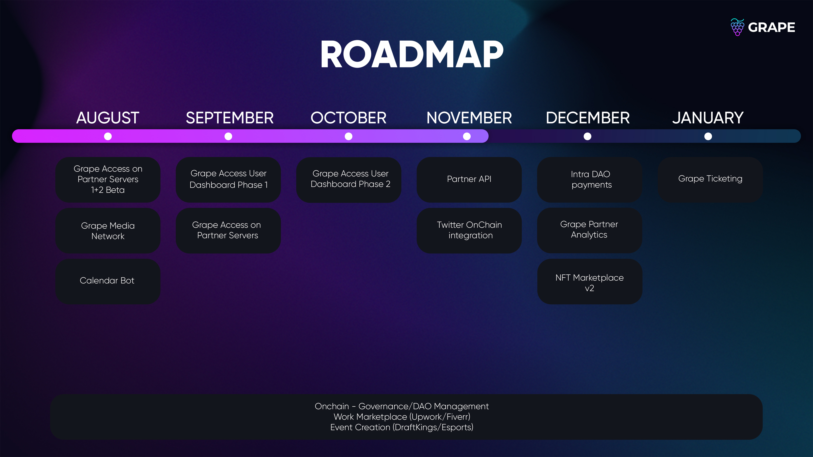

# Quick Start | FAQ

\[_You want to use or are using a Grape product? Your FAQ is_ [_here_](partners.md)_._]

### Where to buy **$GRAPE?**

The easiest way to buy $GRAPE is through a DEX like [<mark style="color:purple;">**Raydium**</mark>](https://raydium.io/swap) or [<mark style="color:purple;">**Jupiter**</mark>](https://jup.ag).

### Grape Access (for users)

In order to use Grape Access, you need to follow the steps described in [<mark style="color:purple;">**#grape-access**</mark>](https://ptb.discord.com/channels/837189238289203201/837954635116707861/922580232958013440) on our [<mark style="color:purple;">**Discord**</mark>](https://discord.gg/greatape). Those steps are equivalent to most other Discord servers that use Grape Access. Please carefully read the instructions and don't forget to click on the emoji at the end.

Some DIscord servers require an initial verification before you're able to verify with Grape Access. If you are unsure, refer to the #rules channel or ask nicely.

#### Is Grape Access safe?

Yes! Grape takes security and privacy very seriously and Grape Access _**can only read your wallet**_ and your wallet's assets. You are always in full control and at no point in time is Grape able to see more of your wallet than anyone is able to, using the Solana Explorer. Grape Access verifies that you own control over your wallet by signing a message using your wallet locally on your computer. Your private key is never shared with Grape and Grape only compares your signature against your public key.

The power of Grape Access comes by combining your wallet information with your Discord ID. That way you are able to verify your ownership of your assets in Discord and can get respective roles and permissions if they exist on a Discord server.

The beauty of this process is, that you have the right to be immediately forgotten by unlinking your Discord ID at any time.

#### Supported Wallets

Currently, we support [<mark style="color:purple;">**Phantom**</mark>](https://phantom.app), [<mark style="color:purple;">**Solflare**</mark>](https://solflare.com), [<mark style="color:purple;">**Sollet**</mark>](https://www.sollet.io), and [<mark style="color:purple;">**Slope**</mark>](https://slope.finance).\
Verifying your wallet using Ledger also works. Just head over to the Grape [<mark style="color:purple;">**Discord**</mark>](https://discord.gg/greatape) and send _!verify_ as a direct message to @GRAPE. Our Grape bot will gladly assist you.

### Grape Dashboard

The Grape [<mark style="color:purple;">**Dashboard**</mark>](https://verify.grapes.network) shows your portfolio, registered servers, connected accounts, and wallets. Under 'SETTINGS' you can easily check your primary wallet and your connected Discord ID that you can also unlink with just a click.

The Dashboard also has an amazing viewer for all your NFTs.

Get started by joining the Grape [<mark style="color:purple;">**Discord**</mark>](https://discord.gg/greatape) and verify your wallet in [<mark style="color:purple;">**#grape-access**</mark>](https://discord.gg/greatape).

## FAQ

### **Are there any requirements for keeping membership benefits?**

Yes! In order to keep your membership benefits, you must meet the requirements for your [<mark style="color:purple;">**Membership Class**</mark>](../grape-community/get-involved/membership-classes.md).

### **Is there a $GRAPE Airdrop?**

No! There never was. But [<mark style="color:purple;">**get involved**</mark>](../grape-community/get-involved/), join our awesome [<mark style="color:purple;">**events**</mark>](https://twitter.com/EventsGrape), and win some $GRAPE!

### **How can I participate in Grape votes?**

Great that you ask! In order to be able to shape the future of Grape, you need to be a member of the [<mark style="color:purple;">**Grape DAO**</mark>](../grape-community/get-involved/dao-application.md). If you are already a DAO Member, even better! Have a look at how creating [<mark style="color:purple;">**Proposals and Voting**</mark>](../grape-dao/proposals-and-voting/) works.&#x20;

### **What are the Tokenomics?**

You can find everything about our Tokenomics [<mark style="color:purple;">**here**</mark>](../tokenomics-and-treasury/tokenomics.md).

### **How do I switch verified wallets?**

Just unlink & disconnect the old verified wallet and then verify the new wallet. **Keep Discord open to avoid losing roles previously achieved**. There are two methods to unlink:

Send _!unlink_ as a direct message to @GRAPE on our [<mark style="color:purple;">**Discord**</mark>](https://discord.gg/greatape) and follow the instructions, or use our   [<mark style="color:purple;">**Dashboard**</mark>](https://verify.grapes.network) to disconnect your old wallet (Supported for Phantom, Solflare, Sollet, and Slope).

1. Unlink your Discord & Unregister Server (buttons right side of Dashboard)
2. Disconnect the old wallet (top right)
3. Connect the new wallet&#x20;
4. Link your Discord & Re-Register Servers again.&#x20;
5. Find the [<mark style="color:purple;">**#grape-access**</mark>](https://discord.gg/greatape) to un-react & re-react to the emoji in the message.&#x20;
6. To check which wallet is verified, send _!verify_ as a direct message to @GRAPE on our [<mark style="color:purple;">**Discord**</mark>](https://discord.gg/greatape).

### **What are your Official Links and Channels?**

* Discord: [https://discord.gg/greatape](https://discord.gg/greatape)
* Twitter: [https://twitter.com/grapeprotocol](https://twitter.com/grapeprotocol) | Events: [https://twitter.com/EventsGrape](https://twitter.com/EventsGrape)
* Website:\* [https://grapes.network/](https://grapes.network)
* Dashboard:[https://verify.grapes.network/](https://verify.grapes.network)
* Documentation: [https://docs.grapes.network/](https://docs.grapes.network)
* Safety Sites: [https://safety.grapes.network/](https://safety.grapes.network)
* NFT Marketplace: [https://nft.grapes.network/](https://nft.grapes.network)
* DAO: [https://dao.grapenetwork.org/](https://dao.grapenetwork.org)
* DAO (Invite): [https://dao.grapenetwork.org/invites/yEaxWY9MNq](https://dao.grapenetwork.org/invites/yEaxWY9MNq)__
* _THERE IS NO Official Telegram, Slack, Snapchat, Instagram, LinkedIn, or WeChat_

### **Is there a Roadmap?**

Sure, there are grape things ahead!

